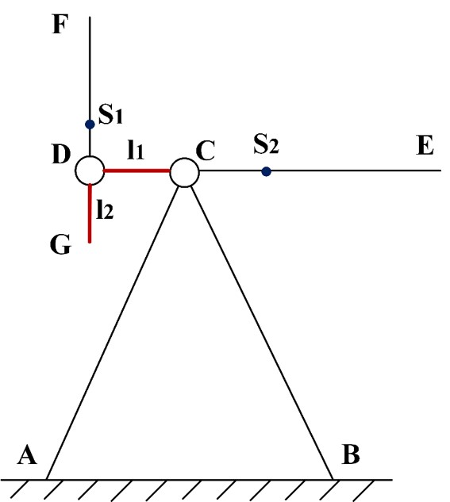
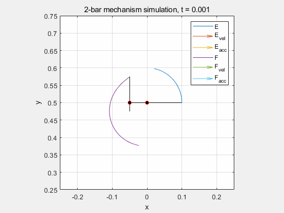
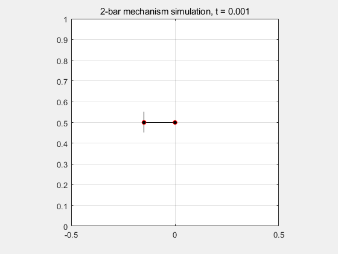

# Problem


For the above mechanism, find the best joint position, so that the system swings for the longest time under gravity with zero initial speed at given initial position. 

# Result

Followings are some of the results under different damping

| C=0.05Nm/(rad/s) and optimized mechanism| C=0.05Nm/(rad/s) and random mechanism|
|-|-|
| **C=0.01Nm/(rad/s) and optimized mechanism**| **C=0.04Nm/(rad/s) and optimized mechanism**|

# Detailed discription

[report](media/report.pdf)

# Usage

1. Run kinematic analysis for velocity equation and acceleration equation using Symbolic Toolbox
```
kinematics_analysis.m
```

2. Run dynamic analysis with 4th Adams form and plot the animation under given dynamics parameters
```
dynamics_analysis.m
```

3. Optimize for longest swing time with ga (genetic algorithm)
```
time_optimize.m
```
